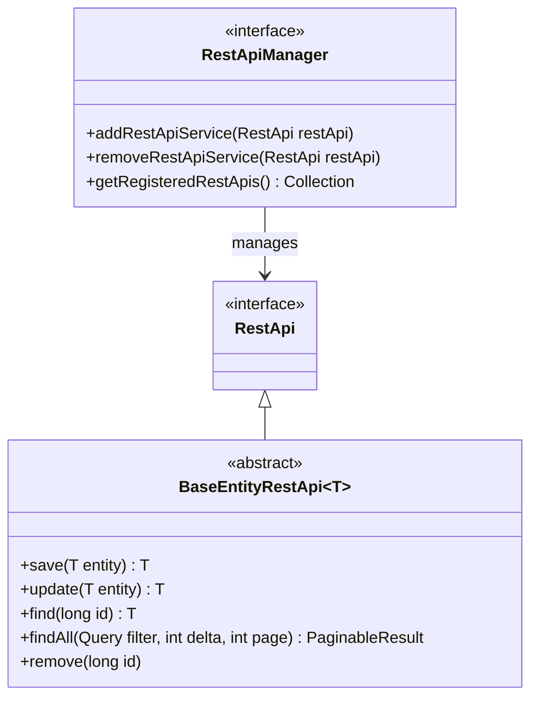
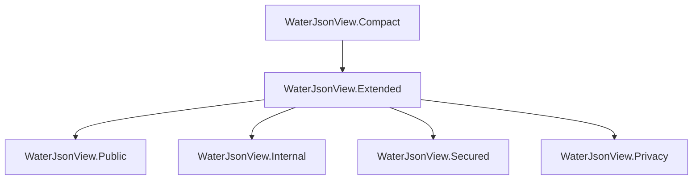
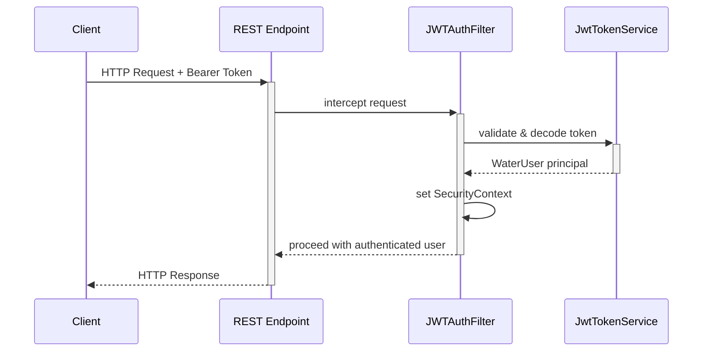

# Rest Module

The **Rest** module provides the full REST layer for the Water Framework, offering a dual-interface approach that supports both **JAX-RS** (Apache CXF) and **Spring MVC** out of the box. It handles REST controller registration, JWT authentication, JSON serialization views, exception mapping, Swagger/OpenAPI documentation, and entity CRUD endpoints.

## Architecture Overview

```mermaid
graph TD
    A[Rest Module] --> B[Rest-api]
    A --> C[Rest-jaxrs-api]
    A --> D[Rest-spring-api]
    A --> E[Rest-persistence]
    A --> F[Rest-service]
    A --> G[Rest-security]
    A --> H[Rest-api-manager-apache-cxf]

    B -->|defines| I[RestApi / RestApiManager interfaces]
    C -->|JAX-RS annotations| J[@FrameworkRestApi]
    D -->|Spring MVC annotations| K[@FrameworkRestController]
    E -->|entity CRUD| L[BaseEntityRestApi]
    F -->|implementation| M[RestApiManagerImpl]
    G -->|JWT filters| N[GenericJWTAuthFilter]
    H -->|CXF bus| O[CXF REST server setup]
```

## Sub-modules

| Sub-module | Description |
|---|---|
| **Rest-api** | Core REST interfaces: `RestApi`, `RestApiManager`, exception mapping, JSON view definitions |
| **Rest-jaxrs-api** | JAX-RS specific base classes and `@FrameworkRestApi` annotation for CXF-based REST controllers |
| **Rest-spring-api** | Spring MVC specific base classes and `@FrameworkRestController` annotation for Spring-based REST controllers |
| **Rest-persistence** | Entity-oriented REST support via `BaseEntityRestApi` with automatic CRUD endpoint generation |
| **Rest-service** | Default implementation of `RestApiManager` and the REST controller lifecycle |
| **Rest-security** | JWT authentication filters for both JAX-RS (`CxfJwtAuthenticationFilter`) and Spring (`SpringJwtAuthenticationFilter`) |
| **Rest-api-manager-apache-cxf** | Apache CXF bus configuration and REST server management for OSGi environments |

## Key Concepts

### REST Interface Hierarchy



- **RestApi**: Marker interface for all REST controllers. Any class implementing `RestApi` is automatically discovered and registered by the `RestApiManager`.
- **RestApiManager**: Manages the lifecycle of REST endpoints, handling registration and de-registration.
- **BaseEntityRestApi\<T\>**: Provides out-of-the-box CRUD REST endpoints for any entity extending `BaseEntity`.

### Dual-Interface Pattern

The framework supports two annotation strategies for REST controllers:

**JAX-RS (CXF):**
```java
@FrameworkRestApi
@Path("/water/myentities")
public interface MyEntityRestApi extends RestApi {
    @GET
    @Path("/{id}")
    @Produces(MediaType.APPLICATION_JSON)
    MyEntity find(@PathParam("id") long id);
}
```

**Spring MVC:**
```java
@FrameworkRestController
@RequestMapping("/water/myentities")
public class MyEntityRestController implements RestApi {
    @GetMapping("/{id}")
    public MyEntity find(@PathVariable long id) { ... }
}
```

Both approaches are automatically discovered by the runtime and registered into the REST layer.

### JSON Views

Water defines a JSON view hierarchy to control field serialization granularity:



| View | Use Case |
|---|---|
| **Compact** | Minimal fields for lists and references |
| **Extended** | Full public-safe field set |
| **Public** | Public-facing external APIs |
| **Internal** | Internal service-to-service calls |
| **Secured** | Authenticated users with security context |
| **Privacy** | Full data including PII (restricted) |

Usage example:
```java
@JsonView(WaterJsonView.Public.class)
private String email;

@JsonView(WaterJsonView.Internal.class)
private String internalCode;
```

### JWT Authentication



The `GenericJWTAuthFilter` is the base class for JWT token validation. Runtime-specific implementations:

- **CxfJwtAuthenticationFilter** — JAX-RS `ContainerRequestFilter` for Apache CXF
- **SpringJwtAuthenticationFilter** — Spring `OncePerRequestFilter` for Spring MVC

Both extract the `Authorization: Bearer <token>` header, validate the JWT, and inject the authenticated user into the security context.

### Exception Mapping

REST exceptions are mapped to HTTP status codes via `GenericExceptionMapperProvider`:

| Exception | HTTP Status |
|---|---|
| `ValidationException` | 422 Unprocessable Entity |
| `UnauthorizedException` | 401 Unauthorized |
| `EntityNotFound` | 404 Not Found |
| `DuplicateEntityException` | 409 Conflict |
| `RuntimeException` | 500 Internal Server Error |

### Entity CRUD Endpoints

By extending `BaseEntityRestApi<T>`, you get standard CRUD endpoints:

| HTTP Method | Path | Action |
|---|---|---|
| `POST` | `/water/{entities}` | Create entity |
| `PUT` | `/water/{entities}` | Update entity |
| `GET` | `/water/{entities}/{id}` | Find by ID |
| `GET` | `/water/{entities}` | Find all (paginated) |
| `DELETE` | `/water/{entities}/{id}` | Remove entity |

Pagination is supported via `delta` (page size) and `page` (page number) query parameters.

## Configuration Properties

| Property | Default | Description |
|---|---|---|
| `it.water.rest.security.jwt.secret` | — | JWT signing secret |
| `it.water.rest.security.jwt.issuer` | `WaterFramework` | JWT token issuer |
| `it.water.rest.security.jwt.expiration` | `86400` | Token expiration in seconds |
| `it.water.rest.url.base` | `/water` | Base REST URL prefix |

## Usage Example

```java
// 1. Define REST interface (JAX-RS style)
@FrameworkRestApi
@Path("/water/products")
public interface ProductRestApi extends RestApi {
    @POST
    @Consumes(MediaType.APPLICATION_JSON)
    @Produces(MediaType.APPLICATION_JSON)
    Product save(Product product);

    @GET
    @Path("/{id}")
    @Produces(MediaType.APPLICATION_JSON)
    Product find(@PathParam("id") long id);
}

// 2. Implement controller
@FrameworkComponent
public class ProductRestControllerImpl implements ProductRestApi {
    @Inject
    private ProductApi productApi;

    @Override
    public Product save(Product product) {
        return productApi.save(product);
    }

    @Override
    public Product find(long id) {
        return productApi.find(id);
    }
}
```

## Testing

REST endpoints are tested using **Karate** feature files and integration tests:

```gherkin
Feature: Product REST API

  Scenario: Create a new product
    Given url baseUrl + '/water/products'
    And request { "name": "Widget", "price": 9.99 }
    When method POST
    Then status 200
    And match response.name == 'Widget'
```

## Dependencies

- **Core-api** — Base interfaces and annotations
- **Core-security** — Permission annotations (`@AllowPermissions`, `@AllowGenericPermissions`)
- **Apache CXF** — JAX-RS implementation (for CXF-based runtimes)
- **Spring Web MVC** — Spring REST support (for Spring-based runtimes)
- **Jackson** — JSON serialization with view support
